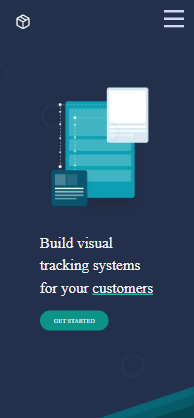

<h1 align="center">Tracking Systems</h1>

## 🔖Preview
<p>
	
	
</p>
  
## 📜 Sobre
<p>
	Página sobre uma aplicação de sistema de rastreamento. Construída apenas para treinar conceitos do Tailwind.
</p>
<p>
	Construído  com base em  um layout de um vídeo do Youtube.
</p>


## 🚀 Tecnologias
### Frontend:
- React
- Tailwind
- Nextjs
- Typescript

## 💻 Iniciando o Projeto


### Requisitos

**Clone o Projeto e acesse o Diretório**

```bash
$ git clone https://github.com/andreydantasvf/Tracking-Systems && cd Tracking-Systems
```

**Para iniciar a aplicação web:**
```bash
$ npm install
```
```bash
$ npm run dev
```

---
Feito por Andrey Dantas 👋 Siga minhas redes sociais:
- [Instagram](https://www.instagram.com/andreydantasvf/)
- [Twitter](https://twitter.com/andreydantasvf)
- [Linkedin](https://www.linkedin.com/in/andreydantasvf/)